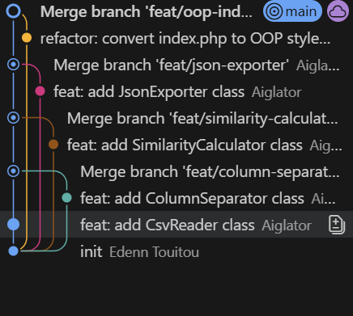
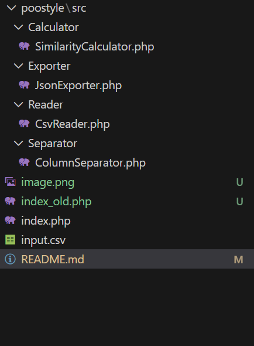

# CSV Reader POO PHP

## Description

Ce projet transforme un script PHP impératif en code orienté objet (POO).

Le script lit un fichier CSV contenant 2 colonnes de nombres. Pour chaque nombre de la colonne gauche, il compte ses occurrences dans la colonne droite et multiplie ces deux valeurs. Le résultat final est la somme de toutes ces multiplications.

## Captures d'écran




## Structure du projet

```
├── index.php                      # Script principal (version OOP)
├── input.csv                      # Fichier de données
├── sortedInput.json               # Export JSON des données triées
└── poostyle/
    └── src/
        ├── Reader/
        │   └── CsvReader.php      # Lecture du fichier CSV
        ├── Separator/
        │   └── ColumnSeparator.php # Séparation des colonnes
        ├── Calculator/
        │   └── SimilarityCalculator.php # Calcul du score
        └── Exporter/
            └── JsonExporter.php   # Export en JSON
```

## Classes

| Classe | Responsabilité |
|--------|----------------|
| `CsvReader` | Lit le fichier CSV et retourne un tableau |
| `ColumnSeparator` | Sépare les données en colonne gauche et droite |
| `SimilarityCalculator` | Compte les occurrences et calcule le score |
| `JsonExporter` | Exporte les données en format JSON |

## Utilisation

```bash
php index.php
```

## Exemple

Avec les données suivantes :
```
3   4
4   3
2   5
1   3
3   9
3   3
```

Le calcul est :
- 3 apparaît 3 fois dans la colonne droite → 3 × 3 = 9
- 4 apparaît 1 fois → 4 × 1 = 4
- 2 apparaît 0 fois → 2 × 0 = 0
- 1 apparaît 0 fois → 1 × 0 = 0

**Résultat : 9 + 4 + 0 + 0 + 9 + 9 = 31**
